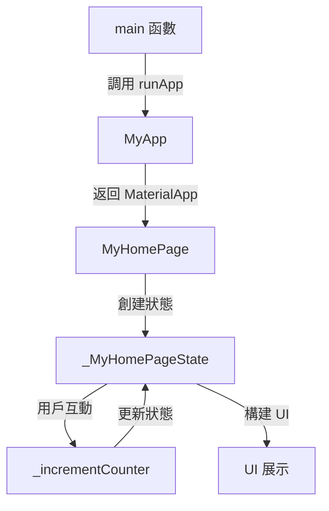

好的，讓我們使用 Mermaid 語法來描述您提供的 Flutter 程式碼的執行流程和邏輯。

1. **起始點 (`main` 函數)**：
   - 程序從 `main` 函數開始。
   - 調用 `runApp` 函數，傳入 `MyApp`。

2. **MyApp (無狀態小部件)**：
   - `MyApp` 是一個 StatelessWidget。
   - `MyApp` 的 `build` 方法返回一個 `MaterialApp` 小部件。
   - 配置 `MaterialApp`，設置標題、主題和主頁面（`MyHomePage`）。

3. **MyHomePage (有狀態小部件)**：
   - `MyHomePage` 是一個 StatefulWidget。
   - 它創建了一個 `_MyHomePageState` 狀態。
   - `_MyHomePageState` 包含一個計數器 (`i`)、三個列表 (`abc`, `bgcolor`, `obj_list`)，以及三個可選的狀態（`abc_text`, `bg`, `obj`）。

4. **_MyHomePageState (狀態)**：
   - 當用戶點擊浮動動作按鈕時，調用 `_incrementCounter` 方法。
   - `_incrementCounter` 會增加 `i` 的值，並根據 `i` 的值循環更新 `abc_text`, `bg`, 和 `obj`。
   - `build` 方法構建 UI，根據當前狀態顯示不同的小部件。

以下是這個流程的 Mermaid 語法表示：

這個流程圖展示了從程序入口到 UI 渲染的整個過程，突出了各個組件之間的互動和狀態的更新機制。